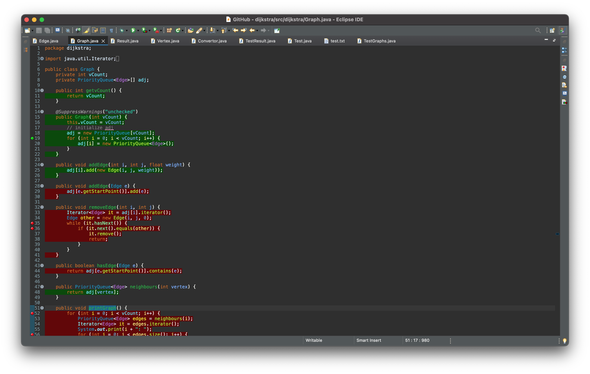

# Génie Logiciel partie tests fonctionnels et structurels

> Groupe TP41 : Floréal RISSO et Téo TINARRAGE

## Question 0

#### a) Assurez-vous que vous disposez d’une implémentation en Java de l’algorithme de Dijkstra, que vous avez bien identifié les entrées et les sorties du programme.

L'implémentation utilisé est celle proposée dans le [sujet](https://steemit.com/graphs/@drifter1/programming-java-graph-shortest-path-algorithm-dijkstra).

#### b) Mettez au propre la spécification de ce programme.

L'implémentation utilisée est celle proposée en exemple, étendue par nous-même. Elle applique l'algorithme _et_ réalise les tests sur ses résultats (au lieu d'avoir un script de test qui appelle un programme implémentant l'algorithme, tout est réalisé par un seul programme).  
Les fichiers de l'implémentation d'origine sont présents tels quels et nos ajouts se situent dans d'autres classes qui exploitent les précédentes.

### Partie Algo de Dijkstra

**Entrées** : liste non-vide d'_arcs (orientés ou non) pondérés_ (c'est à dire numéro de sommet de départ, numéro de sommet d'arrivée, poids(float)) décrivant un graphe (l'existence d'un sommet est impliquée par l'existence d'un arc l'ayant comme extrémité), ainsi que le _numéro du sommet de départ_ pour le calcul des distances, au format JSON*  
**Sortie** : *Distance\* entre chaque sommet du graphe et le sommet de départ choisi, ("Distance" désignant la somme des poids des arcs parcourus par le chemin minimisant cette somme)

\*structure attendue du JSON :  
Pour les données d'entrée

```JSON
{
    "graphs" : [
        {
            "departDijkstra" : <numéro du sommet de départ de l'algo>,
            "estOriente" : <booléen>
            "chemins" : [
                {
                    "depart" : <numéro sommet de départ>,
                    "arrivée" : <numéro sommet d'arrivée>,
                    "poids" : <poids de l'arc (flottant)>
                } ,
                ...
            ]
        }
    ]
}
```

### Partie Test

**Entrée** : Résultats attendus (oracles) pour l'application de l'algo aux données d'entrées spécifiées  
**Sortie** : résultat des tests.

Pour les résultats attendus :

```JSON
{
    "results": [
        "distances" : [...] <liste des distances attendues>
        "parents" : [...] <liste des parents de chaque sommets>
    ]
}
```

## Question 1

Le programme de test est [test.java](./dijkstra/src/test/Test.java).
Son fonctionnement est simple, dans un premier temps il lit les jeux de tests et les oracles.

```java
private static final String testFile = "./tests.json";
private static final String resultFile = "./results.json";

// La fonction qui lit les jeux de tests ecrit dans le fichier "./tests.json".
private static Tester getTests();

// La classe qui contient le contenue du fichier de test.
public static class Tester {
    private Graph[] graphs; // les graphes
    private int[] startDijsktra; // le sommet de depart
}

// La fonction qui lit les oracles
private static Result[] getResults();

// La classe qui contient le resultat attendu d'un jeu de test.
public class Result {
	private float[] distances;
	private int[] parents;
}

```

Ensuite, on appel la fonction qui calcule la distance de Dijsktra sur l'ensemble des jeux de tests et on compare le résultat attendu du résultat obtenu.

```java

// Parcourt des jeux de tests
for(Graph graph : graphs) {
    // Calcul du resultat
    Result result = TestGraphs.Dijkstra(graph,tester.startDijsktra[i]);
    // Comparaison du resultat au resultat attendu
    TestResult testResult = expectedResults[i].equals(result);
}
```

La fonction de comparaison donne de nombreuses informations sur les différences afin d'aider le débogue et à la fin du programme il est indiqué le nombre de test réussi sur le nombre de test tenté.

```java
// La fonction qui vérifie l'egalité des resultats attendue et calculé.
public TestResult equals(Result r) {
    // Des branchement if / else
    // ...
	return new TestResult("Un message expliquant la différence...");
}

// La classe retournée par equals :
public class TestResult {
    // Les resultats sont les mêmes
	private boolean areEquals;
    // Le message d'erreur
	private String error;
}

// Enfin le print final qui compare les nombres de test reussi et echoué.
System.out.println("Resultat : ["+passed+"/"+i+"]");
```

## Question 2

Voici les captures d'écrans montrant les lignes de code exécutés avec le jeu donné dans l'énoncé.

### Le jeu de test :

```JSON
{
  "graphs": [
    {
      "estOriente": false,
      "departDijkstra": 0,
      "sommets": 6,
      "chemins": [
        {
          "depart": 0,
          "arrivee": 1,
          "poids": 2.0
        },
        {
          "depart": 0,
          "arrivee": 4,
          "poids": 3.0
        },
        {
          "depart": 1,
          "arrivee": 4,
          "poids": 4.0
        },
        {
          "depart": 1,
          "arrivee": 2,
          "poids": 5.0
        },
        {
          "depart": 1,
          "arrivee": 5,
          "poids": 2.0
        },
        {
          "depart": 2,
          "arrivee": 3,
          "poids": 2.0
        },
        {
          "depart": 2,
          "arrivee": 5,
          "poids": 4.0
        },
        {
          "depart": 3,
          "arrivee": 4,
          "poids": 2.0
        },
        {
          "depart": 3,
          "arrivee": 5,
          "poids": 5.0
        },
        {
          "depart": 4,
          "arrivee": 5,
          "poids": 2.0
        }
      ]
    }
  ]
}
```

### Le résultat attendu :

```JSON
{
	"results": [
		{
			"distances" :[0.0, 2.0, 7.0,3.4028235E38,3.0,4.0],
			"parents" : [-1,0,1,-1,0,1]
		}
	]
}
```

### La couverture :





## Question 3

Dans la version originale de l'implémentation, qui nous est donnée dans le sujet, n'importe quelle suite de test passait par toutes les instructions, à l'exception de certains fonctions utilitaires qui ne sont jamais appelées.

Cependant, dans notre version (qui ajoute un système de lecture d'entrée sous forme de fichier JSON, et la comparaison de la sortie avec la sortie attendue, ce qui permet l'automatisation des tests, là où avec l'implémentatation initiale les données d'entrée devaient se trouver dans le code directement), Certaines instructions ne pourront pas être éxécutées, notament celles liées au contrôle d'erreur : en effet, on trouve beaucoup de conditions de la forme "si erreur, afficher qque chose, et terminer le programme" : ainsi, s'il n'y a pas d'erreur les instructions d'affichage ne sont pas couvertes, s'il y a erreur le reste du programme n'est pas éxécuté.  
Autre exemple du même type, toutes les séquences de lecture/écriture de fichier impliquent l'utilisation d'un bloc try/catch :

- si une exception est levée avant la fin du bloc try, celui-ci est interrompu, les dernières instructions ne sont donc pas couvertes
- si aucune exception n'est levée, le bloc catch n'est jamais éxécuté  
  Par conséquent, tout bloc try/catch implique qu'une certaine portion de code ne sera pas éxécutée.

Globalement il est impossible de passer par toutes les instructions du programme, cependant les instructions servant à réaliser l'algorithme en lui-même peuvent être toutes traversées par plus ou moins n'importe quelle suite de tests.

## Question 4

### Préembule

Java restreint fortement les possibilités dans les tests, car les types sont static et fort, ainsi il n'est pas possible de donner un mauvais type ou une valeur trop grande.
Alors nous ne pourront pas tester les classes invalides, ni un nombre de sommet inférieure ou égale à zéro.
Mais nous allons testé les poids (négatifs, nul, positif) et si un graphe est orienté ou non.

### Partition des domaines des entrées

| Variable    | poid<0.0 | poid=0 | poid>0.0 | poid in [-inf,inf] |
| ----------- | -------- | ------ | -------- | ------------------ |
| Orienté     | Test 2   |        | Test 1   | Test4              |
| Non orienté |          | Test 3 |          | Test 5             |

(cf. voir tests.json et results.json)

## Question 5

### Préembule

Il est difficile de trouver des mutants très pertinent vu la simplicité du code et le faible nombre d'instructions.

### Premier mutant :

```java
// TestGraph.java ligne 71
// ">" devient ">="
if (v.getDistance() >= u.getDistance() + e.getWeight()) {
						v.setDistance(u.getDistance() + e.getWeight());
						v.setParent(u);
						parents[v.getId()] = v.getParent().getId();
					}
```
Ce mutant est choisi, car il est souvent compliqué de choisir entre "supérieure >" et "supérieure ou égale >=".
```
[V] - Test : 0
[X] - Test : 1
|----> Difference à l'indice : 2 result.parents=1 et expectedResult.parents=0
[X] - Test : 2
|----> Difference à l'indice : 3 result.parents=1 et expectedResult.parents=2
[X] - Test : 3
|----> Difference à l'indice : 6 result.parents=7 et expectedResult.parents=5
[X] - Test : 4
|----> Difference à l'indice : 5 result.parents=4 et expectedResult.parents=-1
Resultat : [1/5]
```
Seul le test zéro passe, c'est normal, car tous les sommets ont des valeurs différentes et aucune somme ne donne le même résultat.
### Deuxième mutant :

```java
// TestGraph.java ligne 67
// "!=" devient "=="

// check if vertex was visited already
if (e.getEndPoint() == v.getId()) {
    continue;
}
```
Ce mutant est choisi, car il est fréquent de se tromper dans les oppérations logiques.
```
[X] - Test : 0
|----> Difference à l'indice : 1 result.distances=7.5 et expectedResult.distances=5.2
[X] - Test : 1
|----> Difference à l'indice : 1 result.distances=-4.3 et expectedResult.distances=-2.1
[X] - Test : 2
|----> Difference à l'indice : 3 result.parents=0 et expectedResult.parents=2
[X] - Test : 3
|----> Difference à l'indice : 1 result.distances=-8.0 et expectedResult.distances=2.0
[X] - Test : 4
|----> Difference à l'indice : 1 result.distances=-3.0 et expectedResult.distances=1.0
Resultat : [0/5]
```

Aucun test ne passe, ce qui est aussi normal. Ici on ne calcule plus le plus court chemin, car on peut passer dans des boucles.

### Troisième mutant :

```java
// TestGraph.java ligne 72
// le "+" devient "-" v.setDistance(u.getDistance() - e.getWeight());

if (v.getDistance() > u.getDistance() + e.getWeight()) {
    v.setDistance(u.getDistance() - e.getWeight());
    v.setParent(u);
    parents[v.getId()] = v.getParent().getId();
}
```
Ce mutant est choisi, car il est intéressant de vérifier s'il n'y a pas une erreur dans l'implémentation.
```
[X] - Test : 0
|----> Difference à l'indice : 1 result.distances=-11.8 et expectedResult.distances=5.2
[X] - Test : 1
|----> Difference à l'indice : 1 result.distances=2.1 et expectedResult.distances=-2.1
[V] - Test : 2
[X] - Test : 3
|----> Difference à l'indice : 1 result.distances=-2.0 et expectedResult.distances=2.0
[X] - Test : 4
|----> Difference à l'indice : 1 result.distances=-1.0 et expectedResult.distances=1.0
Resultat : [1/5]

```
Seul le test deux est validé, car il n'y a que des zéros et zéro est le neutre de l'addition.

### Quatrième mutant :

```java
	if (v.getDistance() > u.getDistance() + e.getWeight()) {
						v.setDistance(u.getDistance() + e.getWeight());
						v.setParent(v);
						parents[v.getId()] = v.getParent().getId();
					}
```
Ce mutant est choisi, car les noms des variables sont mal choisies "u" et "v" sont deux lettres très ressemblante, il est facile de les confondre.
```
[X] - Test : 0
|----> Difference à l'indice : 1 result.parents=1 et expectedResult.parents=0
[X] - Test : 1
|----> Difference à l'indice : 1 result.parents=1 et expectedResult.parents=0
[X] - Test : 2
|----> Difference à l'indice : 1 result.parents=1 et expectedResult.parents=0
[X] - Test : 3
|----> Difference à l'indice : 1 result.parents=1 et expectedResult.parents=0
[X] - Test : 4
|----> Difference à l'indice : 1 result.parents=1 et expectedResult.parents=0
Resultat : [0/5]

```
Le mutant démontre qu'il n'y a pas eu d'erreur.